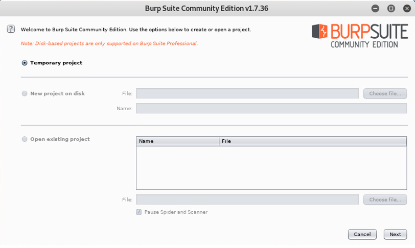

# Introduction

When it comes to cyber security, particularly intrusion detection, one of the most important aspects is to have a firm grasp on the tools at your disposal. This lab is dedicated to familiarizing (or, in my case, refamiliarizing) myself with SimSpace and its virtual machines in addition to analyzing Wireshark and other intrusion detection tools that would be useful for a security practitioner. It will also demonstrate the way two computers can communicate with each other through the process of an ICMP stream or “pinging.” The lab will be taking place over the range of Windows and Kali Linux virtual machines and is split into two parts: The first part will cover the process of the lab, and the second will be an analysis of potential tools for intrusion detection.

## Exploring SimSpace and Establishing an ICMP Stream

### Setting Up SimSpace and Accessing the Win-Hunt and Kali-Hunt Virtual Machines

As mentioned, this lab will be taking place in the virtual machines accessed through SimSpace. As such, the first step is to login to the SimSpace portal. Since this is not my first time using SimSpace, I already have an activated account and used the credentials I previously set to access it. Interestingly, I found that I am already enrolled in this class. Moreover, since the user interface has not been changed since I last used it, the only real action I had to take was to access the virtual machine hub under the “events” panel. It is here I can find the Win-Hunt and Kali-Hunt virtual machines.

### Logging into the Win-Hunt Terminal, Determining Its IP Address, and Running Wireshark

Next, I must access one of the Win-Hunt terminals. These terminals are virtual machines that are running the Windows operating system. While choosing which terminal to use, I noticed that several of my choices already had programs running or were previously tampered. As such, I chose the win-hunt-18 terminal since it appeared to be untouched. The terminal already had credentials entered and upon opening, I was taken to a blank desktop window.

Before I have the two machines communicate with each other, I must first obtain the IP address from the Windows terminal, and the Kali Linux terminal which will be covered later. The primary purpose of this is so that I know what to look for when I start analyzing packets in the later steps. The process is fairly simple: I first access the Windows command terminal by typing “cmd” into the search bar located in the tool bar, then I type in the command, “ipconfig”. From there, the command terminal returns information not only for my virtual machine, but also for other connections in its associated network. The connections the machine has found are named “Ethernet1,” “Ethernet0”, and “Ethernet.” The main takeaway here is that the machine is using the “Ethernet1” connection, and its IP address is 172.16.3.22.

- <i>Figure 1</i>: The Windows command terminal output after entering the command, “ipconfig”. The IPv4 address under “Ethernet adapter Ethernet1” is the IP address of the Windows virtual machine. Other information shown includes the connections’ subnet masks and default gateways.

  

- <i>Figure 2</i>: The Wireshark “Capture” menu prior to commencing a capture session. Notice how there is significantly more activity happening in “Ethernet1” than anywhere else. This is the connection I used for my capture file.

  

With the IP address noted, I now open Wireshark and prepare to capture packets. Given the information I got from the previous step, I select the “Ethernet1” connection for capturing.  Double clicking on the connection name begins the capturing process. Now, every packet of information that is sent either to or from the machine is being recorded. With this in place, I leave the machine and the capturing process running while I move on to the Kali Linux terminal.

### Logging into the Kali-Hunt Terminal, Determining Its IP Address, and Commencing the ICMP Stream

In addition to the Windows terminals found in the SimSpace virtual machine hub, there are also terminals running on the Kali Linux operating system. I have arbitrarily selected the kali-hunt-06 terminal for use in this lab. Using the given credentials, I log on to the machine and am taken to the desktop. It is worth noting that the desktop for Kali Linux looks substantially different from the Windows desktop. The machine also had a program that was running, but I closed it out and now have a fresh workspace.

- <i>Figure 3</i>: The command terminal output for the Kali Linux virtual machine after entering the command, “ifconfig”. Notice how almost the same information is displayed compared to the Windows terminal, except that it is less organized and labeled differently. The IP address for the Kali Linux virtual machine is found under “eth1” (which is, interestingly, the second listed connection) and is labeled as “inet.”

  

Similar to the steps for the Windows terminal, I must find this machine’s IP address. The process is overall the same with only a few minor differences: First, I access the command terminal by clicking an app icon that is found in the side-mounted tool bar, then I enter the command “ifconfig”. You will notice how this command name is different from “ipconfig”, but still overall has the same function. This is another example of how Windows and Kali Linux differ. Nevertheless, with the command entered, the machine returns information about itself and its neighboring connections. In this case, the connection names returned are “eth0,” “eth1,” and “lo”. At first, I had erroneously assumed that the IP address for “eth0” was what the terminal used since it was listed first, but it turns out that it is using the one for “eth1” (similar to how the Windows terminal is using “Ethernet1”). Therefore, the machine’s IP address is 172.16.3.105.  This will be proven later in the report.

Now that I have addresses for both machines, I am now ready to start a continuous ICMP stream from the Kali Linux terminal to the Windows terminal. From my understanding, the process of an ICMP stream is synonymous with one computer pinging another. Therefore, my next course of action is to type into the Kali Linux command terminal, “ping 172.16.3.22”. This will cause the machine to continuously “ping,” or send “request” packets, to the Windows terminal which will, in turn, respond with “reply” packets. The process occurs rapidly and will go on until I tell it to stop. With this in place, I leave the Kali Linux terminal and return to the Windows terminal.

### Analyzing the Capture File with Wireshark and NetworkMiner and Checking for Incidents

Now back on the Windows virtual machine, I reopen Wireshark and take a look at the data being captured. At first glance, there is a plethora of information passing by, but upon closer inspection, I can find the pinging process going on between this machine and the Kali Linux terminal. Of course, there are other packets with different protocols here, but the main focus is the packets with the ICMP protocol labeled “Echo.” It is through these packets that we can observe the communication between the two virtual machines. IP address 172.16.3.105, which is found under the Kali Linux terminal, is sending “request” packets to 172.16.3.22, which is the Windows terminal. Concurrently, the Windows terminal 172.16.3.22 is replying with “reply” packets that are sent to Kali Linux terminal 172.16.3.105. As an aside, since “172.16.3.105” is found under the Kali Linux terminal’s range and is also the address that is used to ping, I can therefore prove that the Kali Linux terminal is using this IP address. There is no significant activity aside from the two machines calling and responding to each other.

- <i>Figure 4</i>: A snippet of the Wireshark capture file. This section is showing the activity that was occurring during the ICMP stream. IP address 172.16.3.105, the Kali Linux terminal, is sending “request” ping packets to 172.16.3.22, the Windows terminal. In turn, it is responding with its own “reply” packets. This process is rapid and continuous.

  

After letting the process go on for a decent amount of time, I end the capturing session for Wireshark, and the pinging process for the Kali Linux machine. The statistics are then stated at the end of the pinging. They indicate that all packets were sent successfully with no packet loss. This is significant because it shows that the two machines were communicating through a clear connection with no interruptions or interferences. I then save the capture session under the name “ICMP_Stream_PCAP” to the Windows terminal’s desktop. The file is saved as a .pcap so that it NetworkMiner, another packet sniffing program, can also read it.

- <i>Figure 5</i>: The statistics printed at the end of the pinging process on the Kali Linux virtual machine. These final statistics state that 542 packets have been transmitted, and 542 packets have been received with 0% packet loss. This implies that the packets were transmitted to the destination without issue and that there was an established connection.

  

The next and final step in the lab process is to use Wireshark and NetworkMiner to analyze the capture file and check for any incidents. For the sake of this lab, I will be defining “incidents” as any intrusions, interferences, vulnerabilities, or potential interceptions. To start, and because I am most familiar with it, I will be using Wireshark first. With the capture file open, I am given a log of all the packets that were sent and received over the course of the capture session. In it, of course, is the ICMP stream that went on between the two terminals. To analyze the capture file, I select the “Expert Information” option under the “Analyze” panel. This will highlight any packets or events that would be of interest to an analyst. Figure 6 shows a full list of the events, and the main points of interest are the warning flags at the top of the list. These warnings are stating that there were DNS query retransmissions. According to networking service NS1, these retransmissions imply packet loss. However, these events were recorded prior to the ICMP stream which means that it was occurring with another device. Aside from these minor warnings, there are no incidents to report in terms of leaks, vulnerabilities, or intruders.

- <i>Figure 6</i>: The “Expert Information” panel. As mentioned, the only visible issues are the DNS response retransmissions that occurred prior to the ICMP stream.

  

Finally, I will analyze the capture file through the program, NetworkMiner. According to its official website, NetworkMiner is “an open-source Network Forensic Analysis Tool (NFAT) for Windows” that can be used as a “passive network sniffer/packet capturing tool in order to detect operating systems, sessions, hostnames, and open ports.” In short, it is extremely similar to Wireshark. The main difference, at least to me, was a radically different user interface. Being less familiar with this program, I used it only to find the essentials. That is, information about the two terminals and whether any major incidents have occurred. To my knowledge, there were not any incidents to report. The “Anomalies” tab does not show anything, and the “Images,” “Messages,” and “Credentials” tabs are all blank. Therefore, no information was exchanged let alone leaked or intercepted. Figure 7 provides a screenshot of the programs’ main panel along with information about the two terminals. With this last step completed, the lab concludes.

- <i>Figure 7</i>: The information panel in NetworkMiner. Shown here is information about the Windows and Kali Linux virtual machines in addition to other devices on the network. Not pictured are the blank tabs regarding anomalies, images, messaging, and credentials.

  

## Surveying Six Tools on the Virtual Machines and Analyzing Their Implications for Intrusion Detection and Incident Response

One of the primary observations I had about each machine was how they are both operating with security in mind. They are both loaded with tons of cyber security programs with most, if not all, of them being open source. This final part of the lab will be addressing a few of these programs their utility for intrusion detection and incident response. Six tools will be analyzed. Therefore, three will come from Windows, and three will come from Kali Linux. Screenshots of the main screens for all programs will be shown in the appendix.

### Windows

The first program I will be looking at is Brim. Brim is a synthesis of the company’s own code along with another popular network security monitoring tool, Zeek (Brim Security). Brim can either function through the command terminal or through a GUI. The screenshot in the appendix shows the program is a GUI. The function programs similarly to (and does in fact work well with) Wireshark in that it stores packets and data logs, reads .pcap files, and has more sophisticated and organized search mechanics. In terms of intrusion detection and incident response, this program would be useful because it can detect intruders by identifying packets with unrecognized IP addresses, and store capture sessions should an incident occur for further analysis.

- <i>Figure 8</i>: The GUI of Brim at its home screen. Notice its collaboration with Zeek and how it is able to read .pcap files like Wireshark.

  

The next program is Flare. It is described as “a freely available and open-sourced Windows-based security distribution designed for reverse engineers, malware analysts, incident responders, forensicators, and penetration testers” (FireEye). This program is entirely command terminal-based, but also comes with a few other tools such as the string utility FLOSS, and file inspector CFF Explorer. I would say that this tool is useful primarily for incident response since it is meant to reverse engineer malware and identify where payloads may be hiding and where they originated.

- <i>Figure 9</i>: The GUI for CFF Explorer, and command terminals for FLOSS and the Boxstarter for Flare. As implied, Flare is not necessarily one tool, but rather a whole conglomeration of tools.

  

The final Windows program is Snort. Like the other programs, it is open-sourced, but its primary focus is intrusion detection. Its function seems to be fairly simple: It uses a given set of rules that defines malicious network activity, the uses those rules to filter through packets and find any suspicious activity (Snort). No doubt this would be useful for intrusion detection especially since its function is simpler and more straightforward compared to the tricky nature of packet analysis in Wireshark.

- <i>Figure 10</i>: Snort as it appears in the command terminal complete with a little ASCII pig. There is a repeating error at the bottom that prevents me from using the program.

  

### Kali Linux

The first Kali Linux tool will be Metasploit Framework. This is a “Ruby-based, modular penetration testing platform that enables you to write, test, and execute exploit code” (Rapid7). This program is used entirely through the command prompt and can “scan targets, exploit vulnerabilities, and collect data.” This program’s function is primarily penetration testing, although I could argue that this is still pertinent to intrusion detection and incident response since it identifies ways intruders could get in and how potential incidents can occur.

- <i>Figure 11</i>: The terminal page for Metasploit. Features include database creation, a space to input test code, and an ASCII cow.

  

The next program is the eloquently titled Burp Suite. This program “enables automated web vulnerability scanning” across a network, and as such, is used to detect any vulnerabilities while simultaneously minimizing false positives (PortSwigger). It functions primarily through GUI. Like Metasploit, its main focus is prevention. However, prevention is a crucial aspect in protection against intruders and incidents.

- <i>Figure 12</i>: Burp Suite as it appears in its GUI form. This is the free community edition, and only supports temporary projects.

  

The final program is Maltego. Wikipedia (used for the sake of a precise definition) defines it as a “software used for open-source intelligence and forensics.” The program provides information through a GUI panel in a graphical format. It is used for investigations of cyber incidents in addition to forensic studies. This, I would say, is the most useful tool for incident response since its graphical interface can pinpoint where and how things went wrong.

- <i>Figure 13</i>: The GUI panel for the free version of Maltego. Notice how it is arguably the most sophisticated program out of the six.

  

# Conclusion

Overall, this lab was a good refresher for SimSpace, and it was informative to have a deeper look at the programs I have not yet used. There was also good insight provided about how two computers communicate with each other through means of an ICMP string or pinging. I cannot think of any limitations to this lab or how improvements could have been made since it was straightforward, and I am overall familiar with the processes. Nevertheless, my interest in some of these programs has been piqued and I wonder if I will be using them later in the future.

# References

<a href="https://www.brimsecurity.com/" target="_blank">BRIM</a>

<a href="https://portswigger.net/burp" target="_blank">Burp Suite - Application Security Testing Software</a>

<a href="https://www.fireeye.com/blog/threat-research/2017/07/flare-vm-the-windows-malware.html" target="_blank">
FLARE VM: The Windows Malware Analysis Distribution You've Always Needed! - FireEye</a>

<a href="https://en.wikipedia.org/wiki/Maltego" target="_blank">Maltego - Wikipedia</a>

<a href="https://www.netresec.com/?page=NetworkMiner" target="_blank">NetworkMiner - The NSM and Network Forensics Analysis Tool</a>

<a href="https://ns1.com/resources/dns-retransmission" target="_blank">DNS Retransmission - NS1</a>

<a href="https://www.snort.org/" target="_blank">Snort 3 Is Available!</a>

